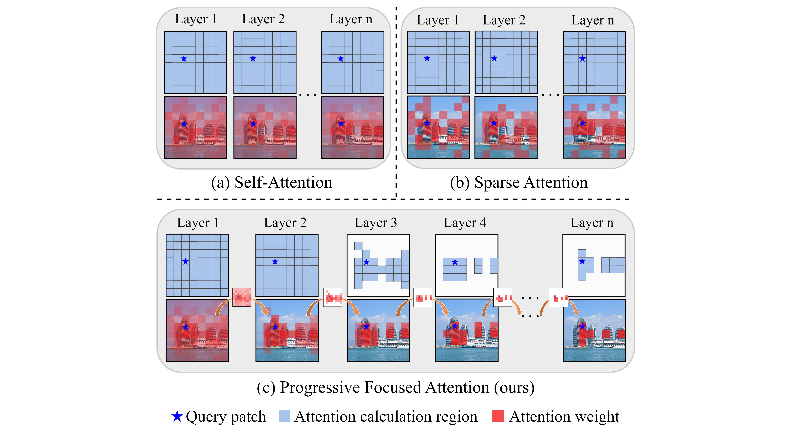
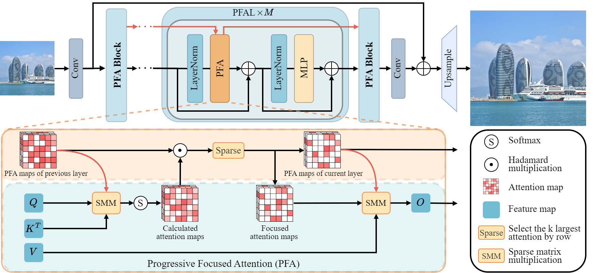
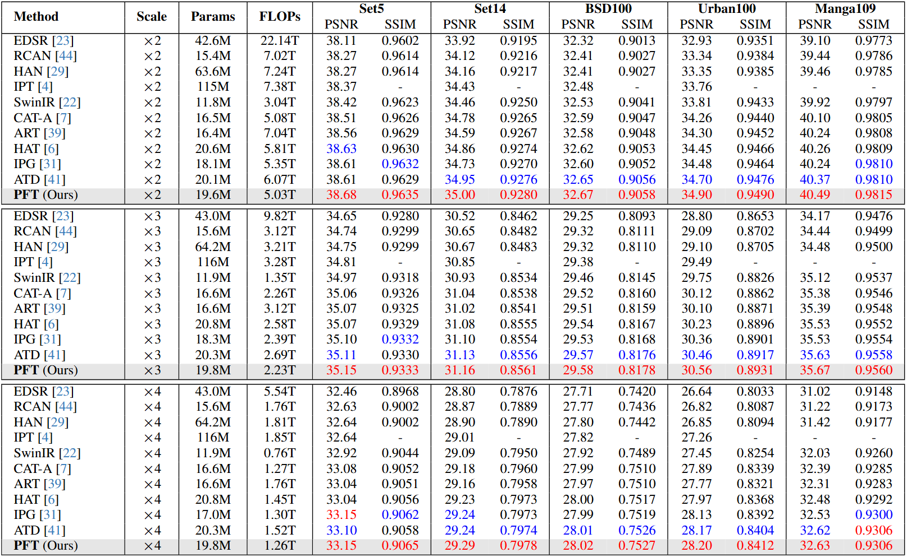
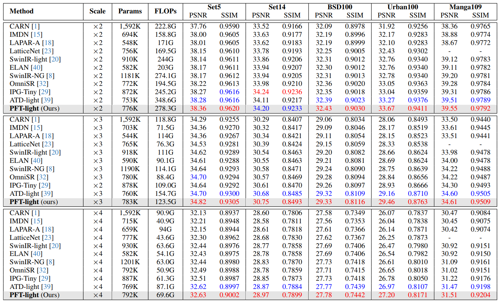
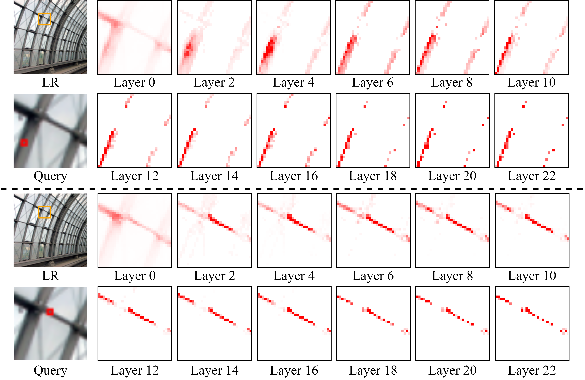

**Progetto relativo al corso di Computer Vision & Deepl Learnin, a.a. 2024/2025**
Docente Dott.ssa **Migliorelli Lucia**
Tutor Dott. **Galdelli Alessandro**


**Studenti**:
Popa V. Gabriel
Perugini Andrea
Tassoni Niccolò


Guida ai train e test per ottenere i risultati conseguiti nel progetto.

------------------------------------------------------------------------------------
Per effettuare i **training** è necessario inserire nel terminale il seguente codice:
python basicsr/train.py -opt options/train/NOME_FILE.yml

dove al posto di NOME_FILE.yml si deve inserire il nome del file di training desiderato, collocato all'interno della cartella options/train.

In particolare, se si desidera effettuare i training sviluppati nel progetti si deve inserire:

Train PFT light sul Set5 --> PFT_light_SRx2_Set5_primotraining.yml 
Train PFT sul Set5 --> PFT_SRx2_Set5_training.yml
Train PFT light sul Monash con loss classica --> PFT_light_SRx2_Monash.yml
Train PFT light sul Monash con loss bilanciato --> PFT_light_SRx2_Monash_bilanciato.yml
Train PFT light sul Monash con loss realismo --> PFT_light_SRx2_Monash_realismo.yml
Train PFT-M sul Monash con loss classica --> PFT_M_SRx2.yml
Train PFT-M sul DIV2K (da scaricare a parte) con loss bilanciato --> PFT_M_SRx2_bilanciato.yml

Se si desidera modificare la tipologia di loss, all'interno di ciascun file yml si deve scorrere fino ad incontrare 'pixel_opt' ed inserire:

#Per la Loss L1
  pixel_opt:
    type: L1Loss
    loss_weight: 1.0
    reduction: mean

#Per la Perceptual Loss + L1, variando i pesi delle due loss
  pixel_opt:
   type: L1VGGPerceptualLoss
   l1_weight: 1.0
   perceptual_weight: 1.0
   reduction: mean


I risultati di tali training saranno salvati automaticamente all'interno della cartella /experiments. Dentro il rispettivo taining effetutato si trova una cartella denominata /models dove si possono trovare i modelli salvati ogni 10k iterazioni. 

**Per effettuare i test sui train effetuati è necessario copiare il path del modello (che si trova all'interno di experiments/models) ed inserirlo nel file di test .yml desiderato, alla voce 'pretrain_network_g'.**

-----------------------------------------------------------------------------------
Per effettuare i **testing** è necessario inserire nel terminale il seguente codice:
python basicsr/test.py -opt options/test/NOME_FILE.yml

dove al posto di NOME_FILE.yml si deve inserire il nome del file di testing desiderato, collocato all'interno della cartella options/test.

In particolare, se si desidera effettuare i testing sviluppati nel progetti si deve inserire:

Test PFT light sul Set5 --> PFT_light_SRx2_Set5_primotraining.yml
Test PFT sul Set5 --> PFT_SRx2_Set5_test.yml
Test PFT light sul Monash con loss classica --> PFT_light_SRx2_monashT.yml
Test PFT light sul Monash con loss bilanciato --> PFT_light_SRx2_monashT.yml
Test PFT light sul Monash con loss realismo --> PFT_light_SRx2_monashT.yml
Test PFT-M sul Monash con loss classica --> PFT_M_SRx2_test.yml
Test PFT-M sul DIV2K (da scaricare a parte) con loss bilanciato --> PFT_M_DIV2k_monash_test.yml


I risultati visivi dei test sono salvati automaticamente all'interno della cartella /results.
----------------------------------------------------------------------------------------------

**DI SEGUITO IL READ.ME ORIGINALE DELLA PFT**

# [CVPR 2025] Progressive Focused Transformer for Single Image Super-Resolution

This repository is an official implementation of the paper "Progressive Focused Transformer for Single Image Super-Resolution", CVPR, 2025.

[](https://arxiv.org/abs/2503.20337)
[](https://drive.google.com/drive/folders/1ChkxVDghFWUtJydJKLp5yssrUfm0VWfg?usp=sharing)
[](https://drive.google.com/drive/folders/19roY74iFLFuqZ_Uoy0jvNVNpRzBrFlyK?usp=sharing)

By [Wei Long](https://scholar.google.com/citations?user=CsVTBJoAAAAJ), [Xingyu Zhou](https://scholar.google.com/citations?user=dgO3CyMAAAAJ), [Leheng Zhang](https://scholar.google.com/citations?user=DH1CJqkAAAAJ), and [Shuhang Gu](https://scholar.google.com/citations?user=-kSTt40AAAAJ).

> **Abstract:** Transformer-based methods have achieved remarkable results in image super-resolution tasks because they can capture non-local dependencies in low-quality input images. However, this feature-intensive modeling approach is computationally expensive because it calculates the similarities between numerous features that are irrelevant to the query features when obtaining attention weights. These unnecessary similarity calculations not only degrade the reconstruction performance but also introduce significant computational overhead. How to accurately identify the features that are important to the current query features and avoid similarity calculations between irrelevant features remains an urgent problem. To address this issue, we propose a novel and effective **P**rogressive **F**ocused **T**ransformer (**PFT**) that links all isolated attention maps in the network through Progressive Focused Attention (PFA) to focus attention on the most important tokens. PFA not only enables the network to capture more critical similar features, but also significantly reduces the computational cost of the overall network by filtering out irrelevant features before calculating similarities. Extensive experiments demonstrate the effectiveness of the proposed method, achieving state-of-the-art performance on various single image super-resolution benchmarks..
> 
>  
> <br/>
>  


## Contents
1. [Enviroment](#environment)
1. [Inference](#inference)
1. [Training](#training)
1. [Testing](#testing)
1. [Results](#results)
1. [Visual Results](#visual-results)
1. [Visualization of Attention Distributions](#visualization-of-attention-distributions)
1. [Acknowledgements](#acknowledgements)
1. [Citation](#citation)

## Environment
- Python 3.9
- PyTorch 2.5.0

### Installation
```bash
git clone https://github.com/LabShuHangGU/PFT-SR.git

conda create -n PFT python=3.9
conda activate PFT

pip install -r requirements.txt
python setup.py develop

cd ./ops_smm
.\make.sh
```

## Inference
Using ```inference.py``` for fast inference on single image or multiple images within the same folder.
```bash
# For classical SR
python inference.py -i inference_image.png -o results/test/ --scale 4 --task classical
python inference.py -i inference_images/ -o results/test/ --scale 4 --task classical

# For lightweight SR
python inference.py -i inference_image.png -o results/test/ --scale 4 --task lightweight
python inference.py -i inference_images/ -o results/test/ --scale 4 --task lightweight
```
The PFT SR model processes the image ```inference_image.png``` or images within the ```inference_images/``` directory. The results will be saved in the ```results/inference/``` directory.


## Training
### Data Preparation
- Download the training dataset DF2K ([DIV2K](https://data.vision.ee.ethz.ch/cvl/DIV2K/) + [Flickr2K](https://cv.snu.ac.kr/research/EDSR/Flickr2K.tar)) and put them in the folder `./datasets`.
- It's recommanded to refer to the data preparation from [BasicSR](https://github.com/XPixelGroup/BasicSR/blob/master/docs/DatasetPreparation.md) for faster data reading speed.

### Training Commands
- Refer to the training configuration files in `./options/train` folder for detailed settings.
- PFT (Classical Image Super-Resolution)
```bash
# batch size = 8 (GPUs) × 4 (per GPU)
# training dataset: DF2K

# ×2 scratch, input size = 64×64, 500k iterations
CUDA_VISIBLE_DEVICES=0,1,2,3,4,5,6,7 python -m torch.distributed.launch --use-env --nproc_per_node=8 --master_port=1145  basicsr/train.py -opt options/train/001_PFT_SRx2_scratch.yml --launcher pytorch

# ×3 finetune, input size = 64×64, 250k iterationsCUDA_VISIBLE_DEVICES=0,1,2,3,4,5,6,7 python -m torch.distributed.launch --use-env --nproc_per_node=8 --master_port=1145  basicsr/train.py -opt options/train/002_PFT_SRx3_finetune.yml --launcher pytorch

# ×4 finetune, input size = 64×64, 250k iterations
CUDA_VISIBLE_DEVICES=0,1,2,3,4,5,6,7 python -m torch.distributed.launch --use-env --nproc_per_node=8 --master_port=1145  basicsr/train.py -opt options/train/003_PFT_SRx4_finetune.yml --launcher pytorch
```

- PFT-light (Lightweight Image Super-Resolution)
```bash
# batch size = 4 (GPUs) × 8 (per GPU)
# training dataset: DIV2K

# ×2 scratch, input size = 64×64, 500k iterations
CUDA_VISIBLE_DEVICES=0,1,2,3 python -m torch.distributed.launch --use-env --nproc_per_node=4 --master_port=1145  basicsr/train.py -opt options/train/101_PFT_light_SRx2_scratch.yml --launcher pytorch

# ×3 finetune, input size = 64×64, 250k iterations
CUDA_VISIBLE_DEVICES=0,1,2,3 python -m torch.distributed.launch --use-env --nproc_per_node=4 --master_port=1145  basicsr/train.py -opt options/train/102_PFT_light_SRx3_finetune.yml --launcher pytorch

# ×4 finetune, input size = 64×64, 250k iterations
CUDA_VISIBLE_DEVICES=0,1,2,3 python -m torch.distributed.launch --use-env --nproc_per_node=4 --master_port=1145  basicsr/train.py -opt options/train/103_PFT_light_SRx4_finetune.yml --launcher pytorch
```


## Testing
### Data Preparation
- Download the testing data (Set5 + Set14 + BSD100 + Urban100 + Manga109 [[download](https://drive.google.com/file/d/1_4Fy9emAcqdiBwVM6FvbJU50LCtaBoMt/view?usp=sharing)]) and put them in the folder `./datasets`.

### Pretrained Models
- Download the [pretrained models](https://drive.google.com/drive/folders/1ChkxVDghFWUtJydJKLp5yssrUfm0VWfg?usp=sharing) and put them in the folder `./experiments/pretrained_models`.

### Testing Commands
- Refer to the testing configuration files in `./options/test` folder for detailed settings.
- PFT (Classical Image Super-Resolution)
- **We have now integrated the patchwise_testing strategy into basicsr/models/pft_model.py. This update allows for successful inference on RTX 4090 GPUs without running into memory issues.**
```bash
python basicsr/test.py -opt options/test/001_PFT_SRx2_scratch.yml
python basicsr/test.py -opt options/test/002_PFT_SRx3_finetune.yml
python basicsr/test.py -opt options/test/003_PFT_SRx4_finetune.yml
```

- PFT-light (Lightweight Image Super-Resolution)
```bash
python basicsr/test.py -opt options/test/101_PFT_light_SRx2_scratch.yml
python basicsr/test.py -opt options/test/102_PFT_light_SRx3_finetune.yml
python basicsr/test.py -opt options/test/103_PFT_light_SRx4_finetune.yml
```


## Results
- Classical Image Super-Resolution



- Lightweight Image Super-Resolution



## Visual Results


## Visualization of Attention Distributions


1. Uncomment the code at this location to enable attention map saving: https://github.com/LabShuHangGU/PFT-SR/blob/master/basicsr/archs/pft_arch.py#L316-L328
2. Perform inference on the image you want to visualize to generate and save the attention maps under the ./results/Attention_map directory:
```
python inference.py -i inference_image.png -o results/test/ --scale 4 --task lightweight
```
3. Modify the corresponding paths and specify the window location you want to visualize in VisualAttention.py (the window is indexed from left to right, top to bottom, assuming the stride equals the window size).
4. Run the following command to visualize the attention map:
```
python VisualAttention.py
```
It should be noted that PFT employs a shift window operation, resulting in different corresponding positions in the attention maps between odd-numbered and even-numbered layers.

## Acknowledgements
This code is built on [BasicSR](https://github.com/XPixelGroup/BasicSR) and [ATD](https://github.com/LabShuHangGU/Adaptive-Token-Dictionary.git).

## Citation

```
@article{long2025progressive,
  title={Progressive Focused Transformer for Single Image Super-Resolution},
  author={Long, Wei and Zhou, Xingyu and Zhang, Leheng and Gu, Shuhang},
  journal={arXiv preprint arXiv:2503.20337},
  year={2025}
}
```
